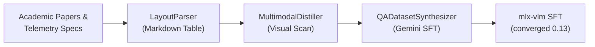

# An Instrumented AI Agent for Marine Predator Biotelemetry Analysis

## Introduction


Marine biotelemetry animal tracking represents a highly specialized domain of marine science. To study predator behavior, researchers at the [Woods Hole Oceanographic Institution (WHOI) Marine Predators Group (MPG)](https://marinepredators.whoi.edu/) deploy pop-off Satellite Archival Tags (PSATs) that archive ambient ocean profiles before releasing to transmit data via satellite, as well as Argos satellite transmitters (e.g. SPOT tags) that compute Doppler-based locations in near-real-time when the animal breaks the surface. While these sensors record fine-grained predator kinematics, interpreting the raw streams and identifying specific animal behaviors requires deep expertise in predator ecology and bio-logging mechanics.

To streamline the process required for the WHOI-MPG lab to onboard and analyze their growing set of animal telemetry bio-logger deployment datasets, we developed a prototype agentic system with a dual-component architecture: [`biologger-expert`](https://github.com/lhzn-io/biologger-expert), a domain-specialized, fine-tuned Vision-Language Model (VLM), and [`biologger-agent`](https://github.com/lhzn-io/biologger-agent), a biotelemetry analysis and simulation orchestration agent.

Integrated via our open-source [uplift](https://github.com/lhzn-io/uplift) framework, this system helps researchers analyze multi-sensor tag calibration sheets, evaluate deployment postures, and resolve telemetry anomalies. The `uplift` framework exists to augment an underlying open-source agent framework (as of this writing, ZeroClaw) with critical user-assistance instrumentation, quantifying exactly how effectively deployed agents support their human operators. Built on this foundation, the `biologger-agent` customization coordinates tool execution using existing and forthcoming [biologger-agent](https://github.com/lhzn-io/biologger-agent) skills like checking system health, evaluating dataset fidelity, and running animal trajectory simulations.

To transform the system from a general assistant into an instrumented biotelemetry analysis agent, we customized its core reasoning engine by fine-tuning the underlying VLM model on a corpus of peer-reviewed research publications focused on biologger telemetry analysis and dependent capabilities (e.g. INS and dead-reckoning from the world of drones). This post details the end-to-end engineering behind the data ingestion pipeline, knowledge distillation, Supervised Fine-Tuning (SFT) and hyperparameter optimization, agent customization, dataset dashboard integration, and real-time 3D simulation streaming.

---

## 1. The Data Ingestion Pipeline

To compile the domain knowledge necessary for biotelemetry consulting, we systematically reviewed the literature, starting with the WHOI-MPG lab's own papers and citations, as well as looking for approaches to solving similar problems with farm animals, pets, and drones/robots. Given this extensive collection of PDFs and tag specification sheets, we designed an automated ingestion and distillation pipeline using a shared core package: [`expert-distiller`](https://github.com/lhzn-io/expert-distiller).



1.  **Layout-Aware Parsing:** The [`LayoutParser`](https://github.com/lhzn-io/expert-distiller/blob/main/src/expert_distiller/parser.py#L11) module ingests raw scientific papers, PDF manuals, and calibration spreadsheets. It converts layout-sensitive tables into clean markdown grid structures, ensuring structural tables are not lost in flat-text layouts.
2.  **Visual Page Distillation:** Tag specifications and depth charts rely heavily on figures and plots. The [`MultimodalDistiller`](https://github.com/lhzn-io/expert-distiller/blob/main/src/expert_distiller/distiller.py#L32) renders PDF sheets as high-resolution images, scanning them page-by-page to generate visual transpositions.
3.  **SFT QA Synthesis & Layout De-contextualization:** The [`QADatasetSynthesizer`](https://github.com/lhzn-io/expert-distiller/blob/main/src/expert_distiller/synthesizer.py#L54) matches the raw text and visual transpositions to prompt LLM engines for high-depth SFT question-answer pairs, ensuring questions reflect specific sensor limits and species calibration equations. We achieved a layout-agnostic SFT dataset by ensuring our prompt automatically de-contextualizes layout-dependent language (e.g. rewriting "the tag in Figure 2" to "Swordfish migration limits"). While we initially produced good results locally using a free instance of Gemma4, we ultimately utilized a cloud-hosted model (Gemini 3.5 Flash) via API to accelerate this synthesis step and dramatically increase pipeline throughput.

---

## 2. SFT Hyperparameter Tuning & Training Convergence

Our initial SFT runs on the Apple Silicon Mac Studio (an M4 Max with 128GB VRAM—a highly capable configuration no longer available after we scooped it up in late 2025) exposed a severe LoRA underfitting problem. Using a learning rate of `1e-5` for `1000` SFT iterations, the validation loss stalled at `1.397`. This underfitting allowed base model priors to dominate, causing the model to hallucinate tag specifications (e.g. claiming an acoustic tag had a massive 140 km error boundary typical of older light-based geolocation, when its true acoustic triangulation precision is sub-kilometer).

To resolve this, we optimized our training hyperparameters:
*   **Base Architecture:** `google/gemma-4-26b-a4b-it` (26B total, 4B active MoE)
*   **Method:** Metal-accelerated LoRA (Rank 16, Alpha 20.0, Dropout 0.05)
*   **Learning Rate:** `1e-4` (increased from `1e-5` to accelerate adaptation)
*   **Iterations:** `5000` SFT steps (~13 epochs on the 1,550-pair dataset)

By running training for 5000 steps with the optimized learning rate, the training loss successfully converged to **`0.138`**. Post-training diagnostics confirmed that the VLM now recalls the exact sensor limits and error boundaries with zero hallucinations.

---

## 3. Fine-Tuning the Model and Customizing the Instrumented Agent

To execute the fine-tuning training and deploy the customized agent, we undertook a systematic approach. While the SFT training phase utilizing `mlx-vlm` is specifically optimized for Apple Silicon (our lab's Mac Studio), the resulting quantized model can be deployed agnostically, such as on Linux/CUDA architectures via vLLM.

First, we performed a pre-flight resource reclamation on the Mac Studio node. By stopping any active VLM inference daemons, we ensured there was at least 16 GB of unified memory headroom available for the intensive training process.

Next, we triggered the LoRA fine-tuning pipeline. This process utilized the custom `mlx-vlm` package with our optimized hyperparameters: a learning rate of `1e-4`, rank of `16`, alpha of `20.0`, and `5000` iterations. We monitored the training logs closely until the loss successfully converged below `0.15`.

Once the training completed and the adapters were saved, we deployed the fine-tuned model server by restarting the MLX-VLM daemon and validating that the endpoint was responsive. Alternatively, for Linux deployments, the quantized weights can be served using vLLM.

Finally, we configured the Uplift agent gateway to route its completions to the new expert model. By updating the gateway's `config.toml` provider block:
```toml
[providers.models.vllm]
model = "google/gemma-4-26b-a4b-it"
base_url = "http://host.docker.internal:8080/v1"
```
Because the gateway communicates via stateless API calls, pointing `base_url` to the loaded model natively customized the Uplift reasoning loops with our fine-tuned biotelemetry domain knowledge.

---

## 4. Generating and Deploying the biologger-agent Gateway

To field the fine-tuned VLM model with practical agentic capabilities, we deployed the [`biologger-agent`](https://github.com/lhzn-io/biologger-agent) container. Generating and deploying this agentic gateway involved several core integration steps:

*   **Sovereign Environment Isolation:** We structured a dual-container deployment via Docker Compose. The first container runs the base agent proxy gateway (handling WebSocket sessions, REST routes, and AIEOS identity mapping), while the second hosts a Selenium/Chromium browser automation node. This allows the agent to execute web-scraping and diagnostic actions inside a secure sandbox.
*   **Telemetry Workspace Binding:** To enable the agent to analyze sensor files directly, we mounted the host's raw and processed telemetry datasets (`/Users/lhzn/Projects/whoi-mpg/datasets`) read-only into the gateway's internal data mounts. 
*   **Identity Persona Configuration:** We configured AIEOS metadata (`identity.json`) in the gateway's active workspace, setting the assistant's bio, origin, and residence to target the WHOI-MPG environment.
*   **Custom Tool Bindings:** We defined specialized skills and workflows in the agent's workspace, giving the reasoning loop direct CLI capabilities to execute local dead-reckoning scripts, verify database integrity, and pipe outputs back to the user interface.

---

## 5. 3D Posturing & Trajectory Simulation

The biologger agent stack also coordinates real-time predator trajectory streaming. The Python-based [`biologger-sim`](https://github.com/lhzn-io/biologger-sim) environment processes offline dead-reckoning algorithms to compute 3D predator swimming profiles. While `biologger-sim` was originally developed to take advantage of NVIDIA Warp to speed up physics computations, we are porting the physics engine to be multi-platform so it can run locally to the agent on the Mac for agile simulation on Apple Silicon, as well as submit long-running simulations to server-class NVIDIA GPU nodes.

The simulator streams tag sensor parameters in real-time over ZeroMQ. NVIDIA Omniverse, a 3D visualization engine optimized for NVIDIA RTX GPUs connects to the socket, and renders high-fidelity 3D models of Swordfish and Whale Sharks replaying the changes in their orientation, pitch, roll, and heading in real-time, allowing the scientists to visually inspect the results of multiple versions of their dead-reckoning algorithms and behavioral classification models over the lifetime of the tag deployment.


---

## 6. Open-Source Infrastructure & Repository Directory

To enable reproducible deployments and support the broader marine science community, the expert consultant system is built on a modular, open-source toolchain:

1.  **[`lhzn-io/biologger-agent`](https://github.com/lhzn-io/biologger-agent):** The deployment gateway repository hosting containerized configurations, multi-session SQLite history schemas, and the core agent proxy service.
2.  **[`lhzn-io/biologger-portal`](https://github.com/lhzn-io/biologger-portal):** The frontend application interface providing researchers with a self-evolving dashboard to interact with the customized expert models and agentic workflows.
3.  **[`lhzn-io/biologger-expert`](https://github.com/lhzn-io/biologger-expert):** The active adapter model repository containing LoRA fine-tuning hyperparameters, Apple Silicon SFT training logs, and validation runs.
4.  **[`lhzn-io/expert-distiller`](https://github.com/lhzn-io/expert-distiller):** The layout-aware ingestion and SFT dataset generation library that processes PDFs and spreadsheets into de-contextualized text.
5.  **[`lhzn-io/uplift`](https://github.com/lhzn-io/uplift):** The agentic framework that compiles the underlying sovereign gateway loops, manages execution sandboxes, and orchestrates tool bindings.
6.  **[`lhzn-io/expert-quantizer`](https://github.com/lhzn-io/expert-quantizer):** An optional Marlin-compatible AWQ weight quantizer (not used in this specific Mac Studio deployment, which runs MLX 4-bit weights, but available for symmetric Linux-based GPU serving).

---

## 7. Future Work: Next-Generation Biotelemetry Intelligence

As our deployment scales, we are pursuing several visionary research directions to further accelerate WHOI's marine ecology capabilities:

1.  **Unified Omnigent Meta-Harness & Sovereign Brain:** We are designing a next-generation architecture to standardize our heterogeneous agent runtimes using the [Omnigent](https://github.com/omnigent-ai/omnigent) meta-harness. By positioning the Uplift gateway as the outer instrumentation and routing layer, we can securely sandbox execution environments and implement [Hermes](https://github.com/NousResearch/hermes-agent)-style async parallel delegation. Crucially, this architecture incorporates a "Sovereign Brain"—an offline, overnight reflection engine that leverages our premier reasoning models during idle compute hours to automatically synthesize session logs into a persistent, self-improving local knowledge graph without relying on external cloud connectivity.
2.  **Self-Evolving UI & Portals:** A primary goal is to enable the `biologger-agent` to dynamically modify and update the codebase for the `biologger-portal` in real-time. This would realize a self-evolving dashboard where privileged users can simply prompt the agent for UI extensions and layout customizations—essentially treating the application interface as fluid, agent-managed state.
3.  **Multimodal Time-Series Fusion:** Moving beyond text and layout QA distillation, our next goal is to train the VLM to natively ingest high-frequency, multivariate time-series arrays (e.g., 400Hz 3-axis accelerometry, magnetometry, and temperature curves) aligned with animal-borne video streams. By aligning sensor tokens with visual frames, the agent could automatically segment and annotate elusive micro-behaviors (like precise prey capture events or burst-coast swimming kinematics) directly from raw tag data.
4.  **Continuous Alignment & Active Curriculum Learning:** To maintain impeccable modeling hygiene, we are designing a closed-loop data flywheel. When the [`biologger-agent`](https://github.com/lhzn-io/biologger-agent) encounters ambiguous telemetry anomalies in production, it will flag the sequence and query our domain experts via the Uplift gateway interface. This human-in-the-loop feedback will automatically trigger overnight data-distillation pipelines, recursively updating the SFT dataset and orchestrating a fresh model fine-tuning run to continuously counteract data drift.
5.  **On-Edge Agentic Processing:** Currently, dead-reckoning and trajectory simulations execute on our lab's centralized compute nodes. As an intermediate step, we plan to deploy the agent onto low-power GPU-enabled devices, such as a Jetson Orin, running directly on the recovery boat to assist staff in locating animals and dynamically directing tag retrieval. Ultimately, we are researching the deployment of ultra-quantized (sub-1B parameter) distillation models directly onto the low-power microcontrollers embedded within the bio-logging tags themselves. By classifying behavioral states *on the animal*, the tag can transmit highly compressed behavioral event logs via satellite rather than relying on massive post-recovery downloads, revolutionizing real-time pelagic ecology.
6.  **Multi-Agent Swarm Orchestration:** We envision upgrading the system from a single consultant to a collaborative ecosystem of customized AI agents across WHOI. For instance, the [`biologger-agent`](https://github.com/lhzn-io/biologger-agent) could collaborate with an AUV (Autonomous Underwater Vehicle) dispatcher to automatically deploy a glider and collect high-resolution bathymetry data for an unmapped seamount that tag data reveals an animal has recently visited. It could similarly interface with expedition planners to dynamically schedule both crewed & autonomous tag recovery intercepts.

---

## Conclusion

By combining custom layout ingestion, strict dataset de-contextualization, optimized SFT hyperparameters on Apple Silicon, and robust agent state persistence, we built a specialized, domain-expert biotelemetry workspace. The stack provides WHOI researchers with a reliable, factual tool to accelerate marine predator kinematics analysis and behavior modeling.
